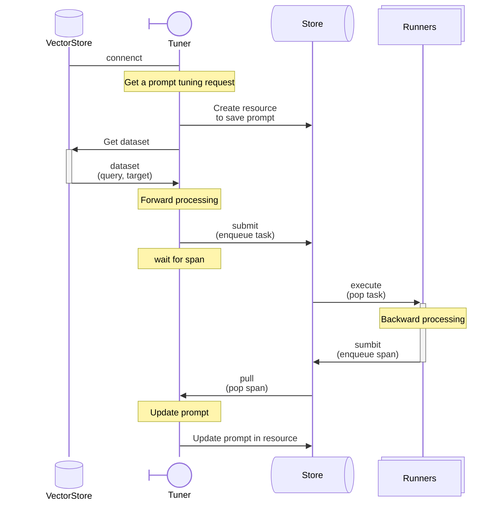

# Lithium-Flower

Prompt tuning framework. Playing with [Lithium-Flower](https://www.youtube.com/watch?v=Wolcpa9s6NU)

- **About Lithium-Flower**

> lithium flower · Scott Matthew · 菅野よう子 · ティム・ジャンセン/TIM JENSEN
> 
> GHOST IN THE SHELL: STAND ALONE COMPLEX O.S.T.+

## Reference
- [agent-lightning](https://github.com/microsoft/agent-lightning)
- [DSPy](https://github.com/stanfordnlp/dspy)

## **agent lightning store**

```sh
cd docker
docker build -t agl/store:dev -f Dockerfile .
docker compose up -d
docker compose down
rm -r ./data
```
- store dashboard: `http://localhost:45993`

## Components

**Store** (Message Queue)
* Use `agent lightning store` to be the tuning message queue.

**Model**
* **model**: Define the `Critique` and `Rewrite` templates.

**Runner** (Agent)
* **optimizer**: Create a `RAGOptimizer` to tune the instruction prompt in the RAG pipeline.

**Tuner**
* **evaluator**: Define a reward function and interface with the vector store.

**Utils**
* **Encoder**: LLM client for generating embeddings.
* **VectorStore**: Vector store client. Here integrate [`LanceDB`](https://github.com/lancedb/lancedb).


## Prompt tuning



## start runner
```sh
# use .env LIGHTNING_NUM_RUNNER to set the number of runner.
python -m src.task.runner
```

## start tuning process
```sh
# after runner started, here put tasks to queue.
python -m src.task.main --batch-size 2 --epochs 1 --beam-n 1 --train-rate 0.1
```