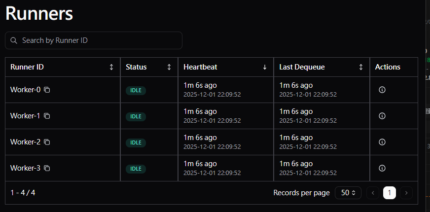
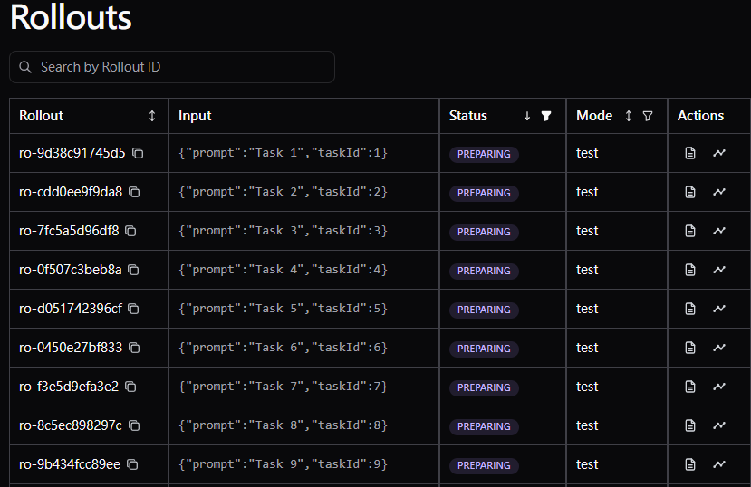

# 🔧 Workers 自動執行問題解決方案

## 問題診斷



從你的截圖可以看到：
- ✅ 4 個 workers 成功啟動（都是 IDLE 狀態）
- ✅ 有 9 個 rollouts 存在
- ❌ 但 rollouts 狀態是 `PREPARING`，workers 無法處理

## 根本原因

**`start_rollout()` vs `enqueue_rollout()` 的差異：**

```python
# ❌ 錯誤方式：start_rollout 不會加入 queue
await store.start_rollout(input=task, mode="test")
# 結果：rollout 被創建，狀態是 PREPARING，但不在 queue 中

# ✅ 正確方式：enqueue_rollout 會加入 queue
await store.enqueue_rollout(input=task, mode="test")
# 結果：rollout 被創建，狀態是 QUEUING，在 queue 中等待 workers 處理
```

## 解決方案

### 方案 1: 重置現有的 rollouts（快速修復）

```bash
# 將現有的 PREPARING rollouts 重置為 QUEUING
python -m src.reset_rollouts

# 然後啟動 workers
python -m src.aglrunner
```

### 方案 2: 創建新的 rollouts（推薦）

```bash
# 使用更新後的腳本創建新的 rollouts（使用 enqueue_rollout）
python -m src.create_test_rollouts

# 啟動 workers
python -m src.aglrunner
```

## 完整測試流程

### 步驟 1: 清理舊數據（可選）
如果你想從頭開始，可以清理 store 中的舊數據。

### 步驟 2: 創建測試 rollouts
```bash
python -m src.create_test_rollouts
```

你會看到：
```
📝 Creating 20 test rollouts and adding to queue...
  ✅ Enqueued Task 1
  ✅ Enqueued Task 2
  ...
  ✅ Enqueued Task 20

✅ Created and enqueued 20 rollouts
🚀 Now run: python -m src.aglrunner
```

### 步驟 3: 啟動 workers
```bash
python -m src.aglrunner
```

你會看到：
```
🔧 Initializing 4 workers...
📊 Workers will share rollouts from the store automatically

🚀 Starting Worker-0...
🚀 Starting Worker-1...
🚀 Starting Worker-2...
🚀 Starting Worker-3...

✅ Worker-0 processing rollout: ro-xxx | Input: {'prompt': 'Task 1', 'task_id': 1}
✅ Worker-1 processing rollout: ro-yyy | Input: {'prompt': 'Task 2', 'task_id': 2}
✅ Worker-2 processing rollout: ro-zzz | Input: {'prompt': 'Task 3', 'task_id': 3}
✅ Worker-3 processing rollout: ro-aaa | Input: {'prompt': 'Task 4', 'task_id': 4}
...
```

## 驗證 Workers 分擔工作

### 在 Dashboard 中查看
1. 打開 Agent Lightning Dashboard
2. 查看 **Runners** 頁面 - 應該看到 4 個 workers 都在處理 rollouts
3. 查看 **Rollouts** 頁面 - 應該看到 rollouts 狀態從 QUEUING → PREPARING → RUNNING → SUCCEEDED

### 使用程式碼查詢
```python
import asyncio
import agentlightning as agl

async def check_workers():
    store = agl.store.LightningStoreClient("http://localhost:45993")
    
    # 查詢 workers
    workers = await store.query_workers()
    for worker in workers.items:
        print(f"{worker.worker_id}: {worker.status}")
    
    # 查詢 rollouts
    rollouts = await store.query_rollouts(limit=20)
    for rollout in rollouts.items:
        worker_id = rollout.attempt.worker_id if rollout.attempt else "None"
        print(f"Rollout {rollout.rollout_id}: {rollout.status} (Worker: {worker_id})")
    
    await store.close()

asyncio.run(check_workers())
```

## 常見問題

### Q: Workers 啟動了但沒有處理任何 rollouts
**A:** 檢查 rollouts 的狀態：
- 如果是 `QUEUING` → 正常，workers 會處理
- 如果是 `PREPARING` → 需要重置或重新創建
- 如果是 `SUCCEEDED` → 已經處理完成

### Q: 如何確認 rollouts 在 queue 中？
**A:** 使用 `enqueue_rollout()` 創建的 rollouts 會自動加入 queue。
你可以在 Dashboard 的 Rollouts 頁面看到狀態為 `QUEUING` 的 rollouts。

### Q: Workers 處理速度太慢
**A:** 調整以下參數：
```python
poll_interval=1.0,        # 減少 polling 間隔
num_workers=8,            # 增加 worker 數量
```

## 總結

**關鍵點：**
1. ✅ 使用 `enqueue_rollout()` 創建 rollouts
2. ✅ Workers 會自動從 queue 拿取並處理
3. ✅ 每個 worker 處理不同的 rollouts（自動負載均衡）
4. ✅ 使用 Dashboard 或程式碼監控進度
